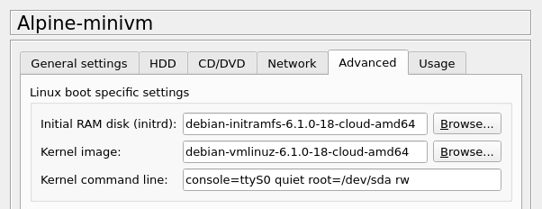

# QEMU VMs based on Docker Images

While I like the simplicity and performance of Docker VMs,
they have some drawbacks when used within GNS3:

* Persistence - Only the persistent directories will be saved.
  Additionally installed software will be lost after restart.
* Host kernel - The Docker VM can only use the features
  available in the host kernel.
* Security - The isolation between the Docker VM and the host
  is not as good as with QEMU VMs.

Looking for a way to make QEMU VMs lighter and easier to setup,
I found this article:  
[Execute Docker Containers as QEMU MicroVMs](https://mergeboard.com/blog/2-qemu-microvm-docker/)

Sad enough the use of QEMU MicroVMs is not possible in GNS3.
GNS3 doesn't offer the `virtio-blk-device` and `virtio-net-device` devices.
Instead of extending GNS3 I used the concept with normal QEMU VMs.
Booting is not as fast as with MicroVMs, but 1.5 seconds boot time
is perfectly acceptable.

The MiniVM is split into several parts, the kernel components and
the root disc image.

The kernel consists of the kernel image, an initial ramdisk and
an optional module disc image.
The kernel can be used for all of the appliances -
it only needs to be built once.

QEMU will directly boot the kernel, without the use of a boot loader.
In GNS3 this is configured in the advanced tab of the appliance template.

For build information enter the `kernel` directory.

## Root Image

The root image is a converted Docker image, so first we need to create that.

The docker context directory is pretty standard,
for example see the `alpine-minivm` directory.
Only the `etc` subdirectory contains additional files
normally provided by Docker but not by QEMU.
Additionally it needs `etc/acpi/PWRF/00000080`, which is run on ACPI poweroff.

Besides these `etc` files the QEMU VM needs an `init` program.
I include a modified version of the init from the MicroVM article.

Now we need to build the Docker VM and do some initial tests.
Then the Docker image needs to be converted to QCOW2 and the
init program added, this is done by the `docker2qcow2` script.

## GNS3 Integration

By importing the appliances `alpine-minivm.gns3a` and `debian-minivm.gns3a`
you can use them in GNS3.
As noted in the usage instruction, for a clean shutdown I recommend to
set the parameter "On close" to "Send the shutdown signal (ACPI)"
in the node properties and/or in the template.
